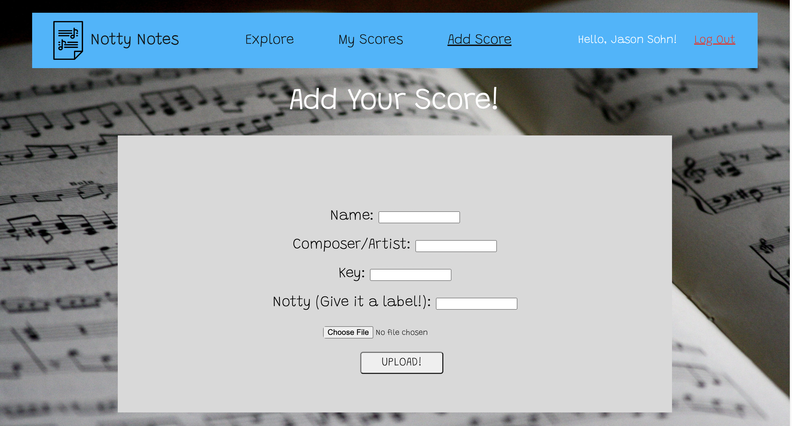
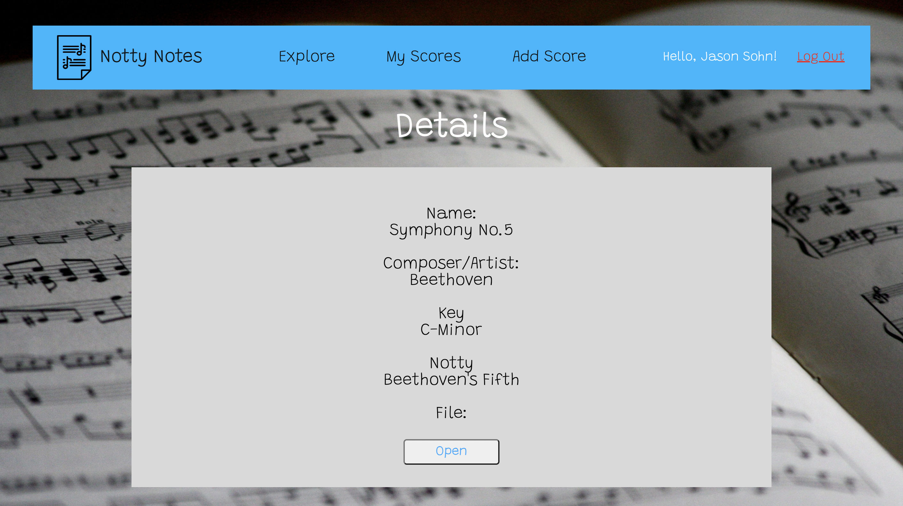
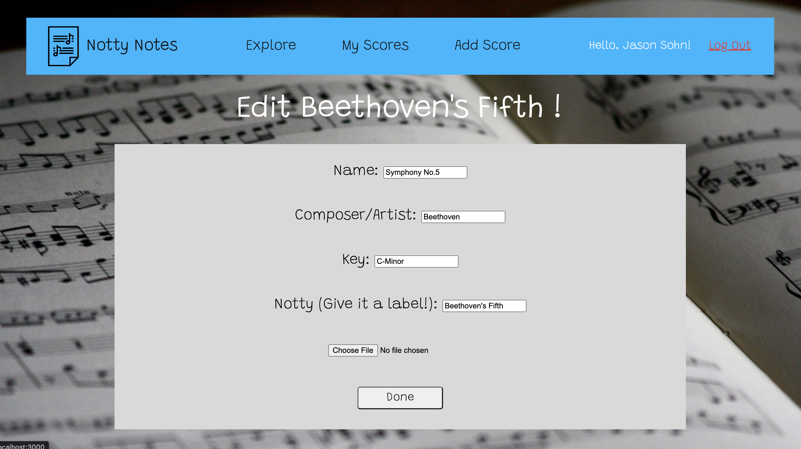

# Notty Notes

- This App allows users to share and download music scores online.

### Screenshots

### Technology used

- Express JS
- Node JS
- Mongo DB
- Javascript
- HTML
- CSS
- Google Cloud APIs
- Heroku

### Getting Started

- [Link to Notty Notes](https://notty-notes.herokuapp.com)
- [Link to Trello Board](https://trello.com/b/KXtNVtrF/project-2)

### Next Steps:

- add sample images of the files
- add more dynamic CSS (scrolling, interactive animations)
